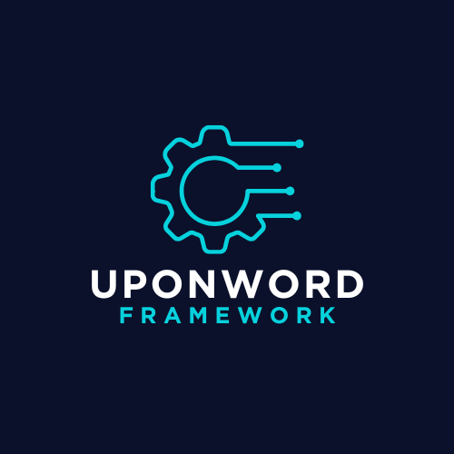

<h1>UponWord - WordPress Theme Development Framework</h1>

Welcome to <strong>UponWord</strong>, a powerful and flexible framework designed to streamline the development of WordPress themes. Whether you're a seasoned developer or just getting started, UponWord provides the tools and structure you need to create high-quality, maintainable themes with ease.

<h2>Table of Contents</h2>
<ul>
    <li><a href="#features">Features</a></li>
    <li><a href="#getting-started">Getting Started</a></li>
    <li><a href="#installation">Installation</a></li>
    <li><a href="#usage">Usage</a></li>
    <li><a href="#configuration">Configuration</a></li>
    <li><a href="#license">License</a></li>
    <li><a href="#contact">Contact</a></li>
</ul>

<h2>Features</h2>
<ul>
    <li><strong>Modular Architecture</strong>: Organize your code with a clean, modular structure.</li>
    <li><strong>Custom Helper Functions</strong>: Simplify common tasks with reusable helper functions.</li>
    <li><strong>Template Enhancements</strong>: Pre-configured template parts for rapid development.</li>
    <li><strong>Customizable Theme Options</strong>: Easily configure theme settings and options.</li>
    <li><strong>Composer Integration</strong>: Manage dependencies with Composer.</li>
    <li><strong>Developer Tools</strong>: Built-in debugging and optimization utilities.</li>
</ul>

<h2>Getting Started</h2>

To get started with UponWord, follow these steps to set up your development environment.

<h3>Prerequisites</h3>
<ul>
    <li>WordPress installation (minimum version 6.4)</li>
    <li>PHP (minimum version 8.2)</li>
    <li>Composer (for dependency management)</li>
</ul>

<h3>Installation</h3>

You can install UponWord by cloning the repository or via Composer.

<h4>Cloning the Repository</h4>
<pre><code>git clone https://github.com/navidnasro/upon-word.git</code></pre>

Activate the theme through the WordPress admin dashboard.

<h4>Composer Installation</h4>
<pre><code>{
    "require": {
        "navidnasro/upon-word": "1.0.0"
    }
}</code></pre>

Run <code>composer install</code> to download and install the dependencies.

<h2>Usage</h2>

UponWord provides a robust foundation for your WordPress themes. Here's a quick overview of how to use its core features.

<h3>Theme Setup</h3>

most of your configuration process take place in ThemeInitializer.php class

<pre><code>public function enqueueFiles(): void{} // to require all necessary assets (js,CSS,..)
public function themeSetup(): void{} // to configure after theme setup operations</code></pre>

and with custom code which brightens your way to know how to use them ,some may be what you were already looking for :)

<h3>Helper Functions</h3>
<pre><code>Cookie::set('custom','custome_value',60*60*3); // by simply calling a method, you created a secure and encrypted cookie that lasts 3 hours</code></pre>
<pre><code>Spam::checkForSpam() // you just easily secured your requests and found whether the user is sending spam requests or not. if so they will be banned for some time :D</code></pre>
<strong>*****and many more reusable and helpful methods to ease the way of building a secure and fast Wordpress theme*****</strong>

<h3>Modular Template Structure</h3>
<pre><code>DemoFactory::getDemoFactory(); // DemoFactory lets you build you website with multiple demos and change between demos with a blink of an eye!!!!!</code></pre>

<h3>Configuration</h3>
<pre>visiting <code>enums/Constants</code> and <code>enums/Defaults is all you need for configuration</code></pre>

<h2>License</h2>

UponWord is open-sourced software licensed under the <a href="LICENSE">MIT license</a>.

<h2>Contact</h2>

For any questions or feedback, feel free to reach out:

<ul>
    <li><strong>Email</strong>: <a href="mailto:your.email@example.com">navidnasro13@gmail.com</a></li>
    <li><strong>GitHub</strong>: <a href="https://github.com/navidnasro">navidnasro</a></li>
    <li><strong>LinkedIn</strong>: <a href="https://www.linkedin.com/in/yourprofile/">navidnasro</a></li>
</ul>

